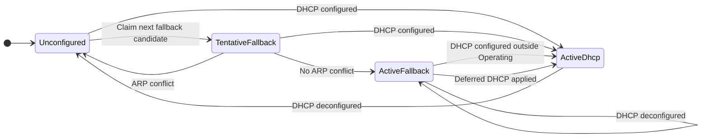

# Deimos

Control program and data integrations for the Deimos data acquisition ecosystem.

See the [project readme](https://github.com/deimoscontrols/deimos/blob/main/README.md) for contact details as well as commentary about
the goals and state of the project.

The control program and the firmware-software shared library share a
[changelog](https://github.com/deimoscontrols/deimos/blob/main/CHANGELOG.md) at the workspace level.

### Install - Rust

```bash
cargo add deimos
```

### Install - Python

```bash
pip install deimos-daq
```

## Features & Roadmap

✅ Implemented | 💡 Planned

| Feature Category | Features |
|------------------|----------|
| Control Loop     | ✅ Fixed-dt roundtrip control loop<br>✅ Network scanning for available hardware<br>✅ Planned loop termination<br>✅ Global event logging<br>✅ Reconnection<br>✅ Low-CPU-usage background operation|
| Control Calcs    | ✅ User-defined custom calcs<br>✅ Explicit (acyclic) calc expression<br>✅ Low-pass filters<br>✅ Sequenced state machines<br>✅ Polynomial calibration curves<br>💡 Cyclic expressions with explicit time-delay<br>💡 Prototype calc w/ rhai script-defined inner function |
| Data Integrations| ✅ User-defined custom targets<br>✅ Manual read/write<br>✅ CSV<br>✅ In-memory dataframe<br>✅ TimescaleDB<br>💡 InfluxDB<br>💡 Zarr file/bucket<br>💡 Generic sqlite, postgres, etc.|
| Hardware Peripherals| ✅ Deimos DAQs<br>✅ User-defined custom hardware<br>✅ User-defined hardware drivers<br>✅ Hardware-out-of-the-loop wrapper|
| Socket Interfaces<br>(peripheral I/O)| ✅ User-defined custom interfaces<br>✅ UDP/IPV4<br>✅ Unix socket<br>✅ Thread channel sideloading<br>💡 TCP<br>💡 UDP/IPV6 |

## Concept of Operation

The control program follows the hardware peripheral state machine,
which is linear except that an error in any peripheral state results
in returning to `Connecting`.

Peripheral states:

1. `Connecting` (no communication with the control machine)
2. `Binding` (waiting to associate with a control machine)
3. `Configuring` (waiting for operation-specific configuration from control machine)
4. `Operating` (roundtrip control)

The controller initialization schedule is:

```text
                  --------------------binding timeout windows
                 /                          /
                /    Controller init       /           
             |====|=====================|====|         timeout to operating
     scan for|                          |==============|
  peripherals|                          |      \
   (broadcast|              sent binding|       \
     binding)|                          |    configuring window
                             peripherals|
                              transition|
                          to configuring|            
```

In words,

1. Scan network for peripherals available to bind
    * Broadcast binding request, but do not send configuration; allow Configuring to time out back to Connecting
2. Initialize controller (set up data integrations, initialize internal state, etc)
3. Send binding request
4. Wait for binding responses
5. Send configuration
6. Wait for start of Operating

Peripherals acknowledge binding and transition to configuring on their next internal cycle (usually 1ms) after receiving a request to bind. They will then wait for configuration input until the timeout
to operating, and either proceed to `Operating` if configuration was
successful, or return to `Connecting` (and likely return immediately to `Binding`) if configuration was not successful.

The control loop then follows a fixed schedule on each cycle:

1. Send control input to peripherals
2. Wait for outputs from peripherals
    * Target synchronization to middle of cycle
3. Update time-sync control
4. Run calculations on peripheral outputs

Control loop timing uses the control machine's best available monotonic clock. Both system time in UTC with nanoseconds and monotonic clock time
are stored in order to support post-processing adjustments to
account for the slow drift of the monotonic clock relative to system time.

## Example: 200Hz Control Program w/ 2 DAQs

```rust
use std::time::Duration;

use deimos::calc::{Constant, Sin};
use deimos::peripheral::{PluginMap, analog_i_rev_3::AnalogIRev3};
use controller::context::ControllerCtx;
use deimos::*;

// The name of the operation will be used as the table name for databases,
// or as the file name for local storage.
let op_name = "test_op".to_owned();

// An optional dictionary mapping user-defined custom hardware
// peripheral model numbers to initializer functions.
let peripheral_plugins: Option<PluginMap> = None;

// Configure the controller
//    Sample interval is taken as integer nanoseconds
//    so that any rounding and loss of precision is visible to the user
let rate_hz = 200.0;
let dt_ns = (1e9_f64 / rate_hz).ceil() as u32;  // Control cycle period

// Define idle controller
let mut ctx = ControllerCtx::default();
ctx.op_name = op_name;
ctx.dt_ns = dt_ns;
let mut controller = Controller::new(ctx);

// Set up any number of data integrations,
// all of which will receive the same data at each cycle of the control loop
//    TSDB-flavored postgres database
let buffer_window = Duration::from_nanos(1); // Non-buffering mode
let retention_time = Duration::from_secs(60 * 60);
let timescale_dispatcher: Box<dyn Dispatcher> = TimescaleDbDispatcher::new(
    "<database name>",  // Database name
    "<database address>", // URL or unix socket interface
    "<username>",  // Login name; for unix socket, must match OS username
    "<token env var>",  // Environment variable containing password or token
    buffer_window,
    retention_time,
);
controller.add_dispatcher("tsdb", timescale_dispatcher);

//    A 50MB CSV file that will be wrapped and overwritten when full
let csv_dispatcher: Box<dyn Dispatcher> =
    CsvDispatcher::new(50, dispatcher::Overflow::Wrap);
controller.add_dispatcher("csv", csv_dispatcher);

// Associate hardware peripherals that we expect to find on the network
// The controller can also run with no peripherals at all, and simply do
// calculations on a fixed time interval.
controller.add_peripheral("p1", Box::new(AnalogIRev3 { serial_number: 1 }));
controller.add_peripheral("p2", Box::new(AnalogIRev3 { serial_number: 2 }));

// Set up calcs that will be run at each cycle
//     Add a constant for duty cycle and a sine wave for frequency
let freq = Sin::new(1.0 / (rate_hz / 100.0), 0.25, 100.0, 250_000.0, true);
let duty = Constant::new(0.5, true);
controller.add_calc("freq", freq);
controller.add_calc("duty", duty);
//     Set a PWM on the first peripheral to change its frequency in time
controller.set_peripheral_input_source("p1.pwm0_freq", "freq.y");  // A value to be written to the hardware
controller.set_peripheral_input_source("p1.pwm0_duty", "duty.y");
//     Set a PWM frequency on one peripheral based on a measured temperature from the other peripheral
controller.set_peripheral_input_source("p2.pwm0_duty", "duty.y");  // Values can be referenced any number of times
controller.set_peripheral_input_source("p2.pwm0_freq", "p1_rtd_5.temperature_K");

// Serialize and deserialize the controller (for demonstration purposes).
// All of the configuration up to this point, including any custom peripheral plugins
// or user-defined calcs, are serialized with the controller and can be written to and read from a json file.
let serialized_controller: String = serde_json::to_string_pretty(&controller).unwrap();
let _deserialized_controller: Controller = serde_json::from_str(&serialized_controller).unwrap();


// Run the control program
// (skipped here because there are no peripherals
// or databases on the network in the test environment).
// controller.run(&peripheral_plugins, None);
```

## Direct-to-PC Ethernet Connection and Statically-Addressed Networks

Deimos DAQs can be connected directly to your computer by ethernet, bypassing the need
for a router or network switch. They can also be used on networks with a switch but no router.

When a Deimos DAQ connects to a network without a DHCP server to provide dynamic IP address assignments,
it will automatically self-assign an IP address in the `169.254.x.[2-254]/16` range.
It will attempt up to 3 candidate addresses, which limits the maximum amount of address resolution spam on the network, while also yielding a trivially small probability that no candidate address is available.

The rev7 firmware's IPv4 address manager follows this state machine:



To connect directly without a router,
1. Connect the DAQ's ethernet cable to your computer's ethernet port (or to a shared network switch with no router).
  * If your computer does not have an ethernet port, an ethernet-to-USB adapter can be used at the expense of added latency.
2. In your computer's network settings, check if a static IP address was assigned in the 169.254.X.X range.
  * This should occur automatically on MacOS and Windows.
  * On linux, you may need to manually set a static IPV4 address: `169.254.254.1/16`

Make sure the netmask for your computer's static address is set to exactly `/16 (255.255.0.0)`.

Otherwise, the DAQ will not recognize your computer as being on the same link-local network, and will not respond to your attempts to scan or bind it.
