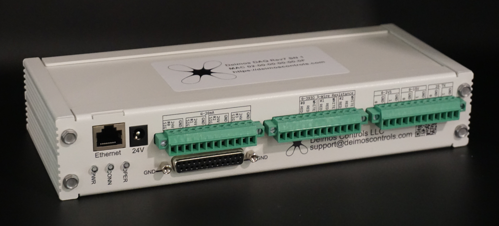
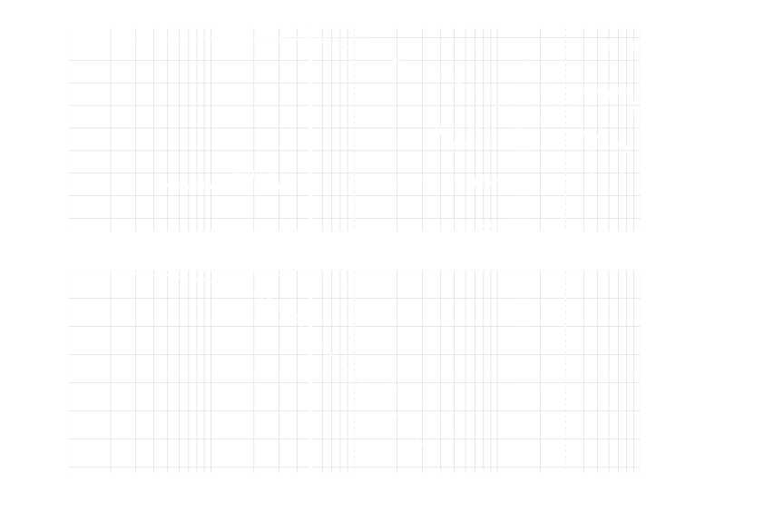
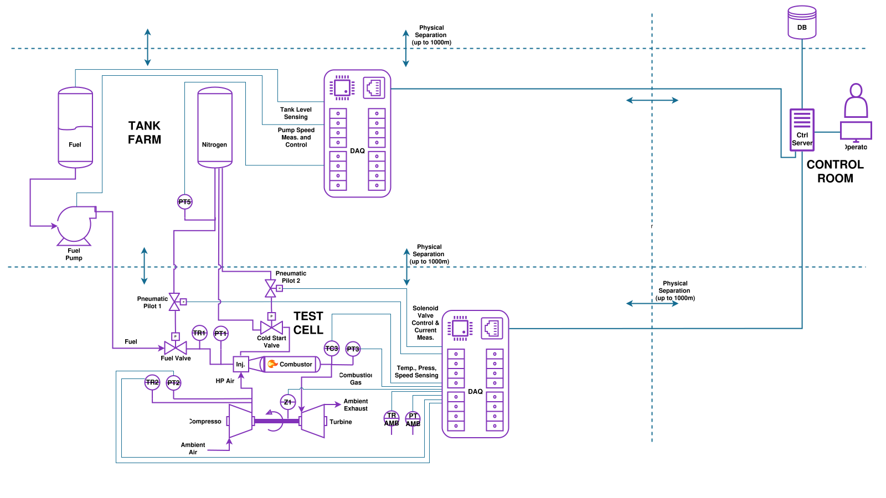
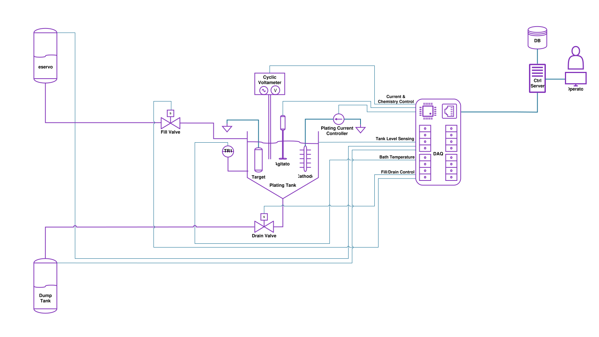

---
hide:
  - toc
  - navigation
---

# 

<section class="home-hero">
  

    
Ethernet DAQ and control hardware

    <h2>Accuracy, Speed, Control: <i>pick three.</i></h2>
    

      Deimos DAQ integrates measurement and real-time controls
      in a single ethernet-connected package for engineers and scientists
      performing experiments on physical systems. 
    

    

      <a class="md-button md-button--primary" href="products/deimos_daq/">View Product</a>
      <a class="md-button" href="products/specs/">Read Specs</a>
    

    <dl class="home-hero__facts">
      

        <dt>Cycle rate</dt>
        <dd>5 Hz - 5 kHz</dd>
      

      

        <dt>Inputs</dt>
        <dd>22 channels</dd>
      

      

        <dt>Outputs</dt>
        <dd>6 channels</dd>
      

    </dl>
  

  <aside class="home-cta" aria-labelledby="home-cta-title">
    
    

      
Pre-launch updates

      <h2 id="home-cta-title">Follow development and availability.</h2>
      

        Sign up for monthly development updates and be the first to hear when
        units are in-stock and ready to ship!
      

      <form
        class="home-signup"
        action="https://deimoscontrols.us13.list-manage.com/subscribe/post?u=d3f613c56803a4b84867251d4&amp;id=62e300351a&amp;f_id=005103e9f0"
        method="post"
        target="home-mailchimp-target"
      >
        <label for="home-signup-email">Email</label>
        

          <input id="home-signup-email" type="email" name="EMAIL" autocomplete="email" required>
          <button type="submit" class="md-button md-button--primary">Sign Up</button>
        

        <input type="text" name="b_d3f613c56803a4b84867251d4_62e300351a" tabindex="-1" value="" hidden>
      </form>
      <iframe
        id="home-mailchimp-target"
        name="home-mailchimp-target"
        title="Mailing list signup target"
        hidden
      ></iframe>
      <a class="home-cta__crowd-supply md-button" href="https://www.crowdsupply.com/deimos-controls/deimos-daq" rel="noopener" target="_blank">
        Follow on Crowd Supply
      </a>
    

  </aside>
</section>
<!-- 
<section class="home-section">
  <h2>[Write a heading for what Deimos DAQ helps people do.]</h2>
  

    <article class="home-feature">
      <h3>Data Acquisition</h3>
      
[Write a short explanation of the measurement side of the product.]

    </article>
    <article class="home-feature">
      <h3>Controls</h3>
      
[Write a short explanation of the control side of the product.]

    </article>
    <article class="home-feature">
      <h3>Open Source</h3>
      
[Write a short explanation of the hardware, firmware, and software openness.]

    </article>
  

</section>

<section class="home-section home-section--split">
  

    <h2>[Write a heading for signal quality / sample path.]</h2>
    

      [Write a concise explanation of accuracy, filtering, timing, and why the
      sample path matters.]
    

    <a class="md-button" href="products/frontends/">Explore Frontends</a>
  

  
</section>

<section class="home-section">
  <h2>[Write a use-case section heading.]</h2>
  

    <a class="home-use-case" href="usecases/turbine/">
      Fluid Systems
      
    </a>
    <a class="home-use-case" href="usecases/motor/">
      Electric Motors
      
    </a>
    <a class="home-use-case" href="usecases/plating/">
      Chemical Processing
      
    </a>
  

</section> -->
