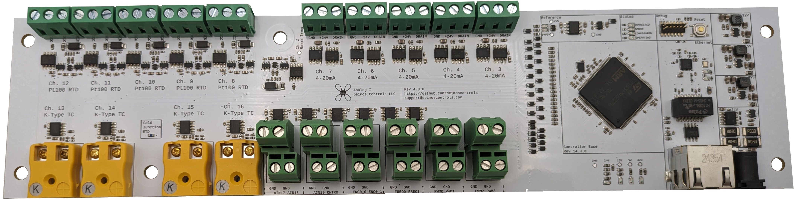

# Deimos DAQ

The Deimos DAQ boasts a set of 22 input channels and 6 output channels,
all available together and operated simultaneously on every cycle.

Fully open-source, the **Deimos DAQ*'s design files, firmware, and control program can all be
found under permissive licenses in the [Deimos project repository](https://github.com/deimoscontrols/deimos).

## :material-graph-outline:{ .lg .middle } Overview

| Feature | Performance |
|---------|-------------|
| Comm. Medium | Ethernet (reliable UDP/IPV4 with full state reassertion) |
| Cycle Rate | 5Hz - 5000Hz, round-trip control with full state reassertion |
| Multi-Unit Time Sync | ~1 microsecond (100ns typ.) |
| Voltage Reference | 0.02% accuracy, 2.5V |
| ADCs | 16-bit SAR, self-calibrating |
| Internal Samplerate | 33kHz burst-scanning w/ synthetic simultaneous sampling |
| Onboard Filtering | Active analog filters, digital Butterworth IIR anti-aliasing filter & Lagrange polynomial fractional-delay FIR sample synchronization filter |
| Supply Voltage | 24V DC |

## :material-controller-classic:{ .lg .middle } Outputs

| Kind | Range | Resolution | Notes |
|------|-------|------------|-------|
| :material-square-wave: 4x PWM  | 1Hz-100kHz | 16-bit | 3.3V logic. Each channel has independent frequency and pulse width. 40 ohm term. |
| :material-square-wave: 4x GPIO  |  | 1-bit | 3.3V logic. Switched once per cycle on request. |
| :material-sine-wave: 2x DAC (Voltage) | 0-2.5V | 12-bit | Accuracy linked directly to voltage reference (0.02%) |

## :material-ear-hearing:{ .lg .middle } Inputs

| Kind | Range | Accuracy | Resolution | Notes |
|------|-------|----------|------------|-------|
| :material-lightning-bolt: 2x Voltage, 1x Gain | 0-2.5V | 0.02% | 38uV | Single-ended, 40V tolerance  |
| :material-lightning-bolt: 2x Voltage, (1/6)x Gain | 0-15V | 0.02% | 228uV | Single-ended, 40V tolerance  |
| :material-lightning-bolt: 2x Voltage, 25.7x Gain | -40 to +57mV | 0.04% | 1.5uV | Single-ended, 40V tolerance |
| :material-fire: 2x K-Type Thermocouple | 90-1600K | 0.5K near room temp | 0.03K | Cold-junction compensated. Material-matched connector. |
| :material-snowflake: 3x 3-Wire Resistance (RTD, strain, etc) | 70-1200K | 0.1K near room temp | 0.02K | Specs refer to use with Pt100 RTD |
| :fontawesome-solid-gauge-high: 4x 4-20mA | 0-33mA | 0.04% | 0.8uA | 24V excitation, 2 or 3-wire, short-circuit protected |
| :material-square-wave: 2x GPIO  |  | 1-bit | 3.3V logic. Read once per cycle on request. |
| :material-square-wave: 2x Frequency | 400Hz-1MHz | 100ppm | 16-bit | |
| :material-square-wave: 1x Pulse Counter | 400Hz-1MHz | N/A | 1 | 64-bit accumulator |
| :material-square-wave: 1x Encoder | | N/A | | Signed 64-bit accumulator, forward/backward counting. |
| :material-thermometer: Diagnostics | ||| Bus current, bus voltage, and cold-junction temperature |

## :material-hub-outline:{ .lg .middle } Connectivity

All Deimos DAQs use unencrypted wired ethernet LAN for communication, and are assigned MAC addresses in the locally-administered block.

This means that untrusted individuals and unrelated hardware should not be given access to the control network.

For more details about networking and security, see the [system details](../system.md).

Multiple DAQ modules can be connected to the same control program; time-synchronization between multiple modules is a first-class
feature, requires no additional network hardware, and typically achieves sub-microsecond average synchronization within a few seconds of the start of an operation. See the [control program examples](https://github.com/deimoscontrols/deimos/tree/main/software/deimos/examples) for reference programs using several DAQs simultaneously.
