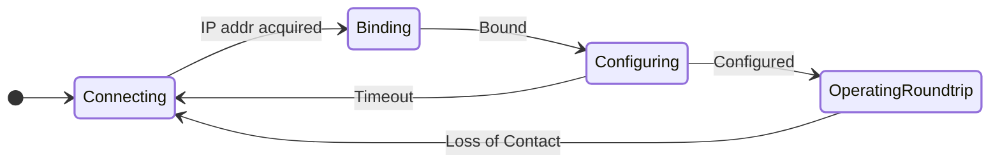
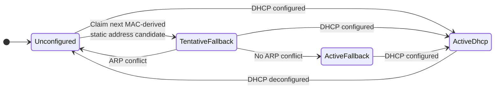

---
hide:
  - navigation
---

# Deimos System Overview

The Deimos system spans DAQ hardware, time-synchronized control program,
and data pipeline components.

  

## :material-state-machine:{ .lg } DAQ State Machine

DAQs behave according to a simple state machine.
They do not contain any significant logic beyond sampling/filtering,
setting outputs, and communicating over ethernet.

### Error-Handling Transitions

In addition to the conditions shown above, any state may return to `Connecting` if

* The DAQ's IP address is deconfigured by the DHCP server
* An internal error occurs
    * Hardfault, watchdog (stalled processor), and panic errors all cause a reboot into `Connecting`
    * There are no _known_ mechanisms for producing an internal error; this fallback exists to handle the unknowns

<!-- ### Streaming

Streaming - sending more inputs from the DAQ to the controller than from the controller to the DAQ - is a common
need for reading inputs at a higher rate in parts of a system with less need for active control.

In the future, streaming behavior will be implemented entirely in the control program by simply setting a large value for
the loss-of-contact missed packet limit and only transmitting every Nth control packet.

Due to the robustness of the DAQ state machine, no modification to the firmware will be required to support streaming. -->

### State Behaviors

The behaviors of each state are

-    `Connecting`

    ---

    * Outputs low
    * Searching for router & acquiring an IP address
    * Typically lasts less than a second

-    `Binding`

    ---

    * Outputs low
    * Waiting for control server to initiate contact
    * This is the idle state - typically minutes to days/months/years

-    `Configuring`

    ---

    * Outputs low
    * Waiting for operation configuration (cycle frequency, etc)
    * Typically lasts 1-10ms

-    `OperatingRoundtrip`

    ---

    * Outputs under active control
    * Cycling at configured frequency
    * Asserting all outputs and reading all inputs at every cycle
    * Typically lasts 100ms-292yr

----

### DAQ Address State Machine

DAQs can function on either statically-addressed or dynamically-addressed networks.
This requires some logic to handle either self-assigning an address or using an
address provided by a router/DHCP server.

This logic is encapsulated in its own state machine that runs underneath the
operational state machine.

## :fontawesome-solid-gears:{ .lg } Software Components

The control system is fully defined in application software, and does not delegate any computation to DAQ modules.

Each component of the system is defined in a Rust **Trait** object, allowing seamless extension with user-defined plugins.

-   :fontawesome-solid-wave-square:{ .lg .middle } __Peripherals__

    ---

    `Peripheral` objects represent physical hardware, but can be spoofed with software constructs for testing purposes.
    
    Each peripheral object handles parsing and forming its packet formats, sanitizing inputs and outputs,
    and providing a set of standard `Calc` objects to perform its typical software-side computations
    such as thermocouple lookup tables.

-   :simple-graphql:{ .lg .middle } __Calcs__

    ---

    `Calc` objects are a (compound) node in an expression graph on the controls server.

    At each time-step of the control program, all `Calc`s run in order to process incoming data
    and determine the outputs for the next cycle.

-   :fontawesome-solid-plug:{ .lg } __Sockets__

    ---

    `Socket` objects provide a communication medium for talking to `Peripheral`s.

    While Deimos DAQs all use one `Socket` type - UDP/IPV4 - the `Socket` layer is provided in order to
    allow the incorporation of user hardware as well as the use of inter-process communication with
    software mockups.

-   :material-database-arrow-up-outline:{ .lg } __Dispatchers__

    ---

    `Dispatcher` objects send data to a database.

    A database can be anything you like, from a simple in-memory table to a file on disk to a proper time-series or relational database on a remote server.

----

## :material-account-hard-hat-outline:{ .lg } Safety & Reliability

Deimos DAQs are built with an eye to longevity, reliability, and best-effort protection of user hardware.
Notable reliability features include

* Ultra-lean firmware
    * No operating system, dynamic memory allocation, threading, mutexes, or event-driven interrupts.
    * No over-the-air updates (or self-reprogramming capability of any kind).
    * Only timer-driven interrupts w/ processor atomics for sharing resources.
* Independent watchdog interrupt & well-defined hardfault behavior
    * In the unlikely case of an unexpected internal error, rather than freezing in a given output state,
    the DAQ will reboot and return to an idle state with outputs set to their default (low) values.
    * Reboot will occur even if the processing state has frozen due to a fully separate watchdog.
* Input overvoltage protection & electrostatic discharge protection.
* All long-life ceramic capacitors; no short-lived electrolytics!
* Generous cycle timing margin (~85%).
* Minimal use of memory-unsafe programming.
    * Firmware: memory-unsafe access only as strictly necessary for register access & memory-mapped I/O.
    * Software: zero memory-unsafe operations.

With that said, the Deimos ecosystem is neither intended nor certified for safety-critical applications.

----

## :material-router-network:{ .lg } Networking

Deimos DAQs use wired ethernet for communication. No special networking equipment is required.

All of the most common network configurations are supported:

* Direct: Connect directly to a control computer's ethernet port.
* Static: Self-assemble IP addresses on a static network without a router.
* Dynamic: IP addresses assigned by a router/DHCP server.

----

## :octicons-unlock-16:{ .lg } Security

The Deimos ecosystem takes security to be a physical concern - similar to most data acquisition and SCADA systems,
modules on the network will bind to any controller without authentication and all traffic is unencrypted.

Put another way - these are _not_ IoT devices! They use ethernet for its excellent data transfer properties, not
with any intent to connect to the global internet.

Control networks are assumed to be airgapped, and no consideration whatsoever is given to preventing unauthorized access,
except that all units ship with MAC addresses in the locally-administered (non-routable) block. This means that they are **not
accessible from outside the local network** if the network's switching hardware is conformant. However, while this provides
a thin layer of protection, it is far from a guarantee - network switching hardware is often compromised and may be reconfigured
maliciously to forward traffic to and from an attacker.

The only hardware on the network should be the control server, switching gear, and the DAQs.
This protects the network from unexpected congestion during operations, prevents MAC address collisions with
unrelated hardware that may also use the locally-administered block, and reduces opportunities for unauthorized access.

Physical mitigations are simple: untrusted individuals and unrelated hardware should not be given access to the control network.
