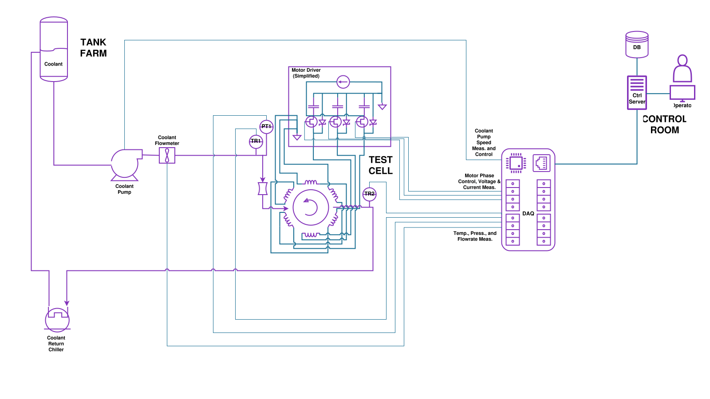

# Use-Case: Switched Motor Development

This example shows a notional 3-phase switched motor control test assembly with a
simplified externally-actuated high-side driver.

In this arrangement, a single DAQ unit has adequate capability to measure and control both the test article
and the supporting lab utilities. The test article, operator, and lab equipment would typically be
in a single room, but may be separated for safety depending on circumstances.

For more advanced motor controller topologies, **additional DAQs can be incorporated and time-synchronized** 
with no extra networking equipment or additional configuration - synchronization is the default, not a bonus feature.
